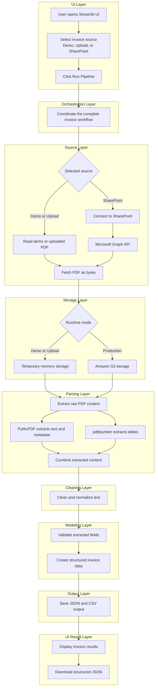

# Invoice Data Parsing Pipeline

A Streamlit application that reads invoice PDFs, extracts structured data, and
saves the results as JSON and CSV files.

## Architecture



In simple terms:

1. The user opens the Streamlit interface.
2. The user selects a demo, uploaded, or SharePoint invoice source.
3. Clicking **Run Pipeline** starts the complete workflow.
4. The selected source fetches the PDF as bytes. SharePoint uses Microsoft
   Graph API.
5. Demo and uploaded PDFs stay temporarily in memory. The production flow
   stores the fetched PDF in Amazon S3 and reads it back for processing.
6. PyMuPDF extracts page text and metadata, while pdfplumber extracts tables.
7. The extracted text is cleaned and normalized.
8. Pydantic validates the invoice fields and creates structured invoice data.
9. The pipeline saves JSON and CSV output files.
10. Streamlit displays the result and provides a JSON download.

## Project structure

```text
data-parsing/
|-- app.py                         # Streamlit interface
|-- sample_invoice.pdf             # Demo invoice
|-- requirements.txt               # Python dependencies
|-- .env                           # Local configuration and secrets
|-- .env.example                   # Safe configuration template
|-- .gitignore                     # Files excluded from Git
|-- output/                        # Generated JSON and CSV output
|-- invoice_pipeline/
|   |-- __init__.py                # Public package imports
|   |-- config.py                  # Environment configuration
|   |-- models.py                  # Pydantic data models
|   |-- step_01_sources.py         # Local, upload, and SharePoint sources
|   |-- step_02_storage.py         # Memory and Amazon S3 storage
|   |-- step_03_parsing.py         # Parsing, cleaning, and extraction
|   |-- step_04_output.py          # JSON and CSV output
|   `-- pipeline.py                # Workflow orchestration
`-- README.md
```

## Run the application

### Option 1: Standard Python and pip

Create and activate a virtual environment:

```powershell
python -m venv env
.\env\Scripts\Activate.ps1
```

Install the dependencies:

```powershell
pip install -r requirements.txt
```

Start Streamlit:

```powershell
streamlit run app.py
```

### Option 2: uv

If `uv` is not installed, install it first:

```powershell
pip install uv
```

Check the available Python versions:

```powershell
uv python list
```

Create an environment with Python 3.11 or newer. Replace `3.11` with another
available version when needed:

```powershell
uv venv env --python 3.11
```

Activate the environment:

```powershell
.\env\Scripts\Activate.ps1
```

Install the dependencies:

```powershell
uv pip install -r requirements.txt
```

Start Streamlit:

```powershell
streamlit run app.py
```

## Document sources and storage

- **Demo invoice:** reads `sample_invoice.pdf` and keeps it temporarily in
  memory.
- **Upload PDF:** accepts a PDF from the Streamlit interface and keeps it
  temporarily in memory.
- **SharePoint + Amazon S3:** appears in the Streamlit source list as a
  **Coming soon** option. Its Run button remains disabled until the production
  connection is enabled. The backend flow is prepared to fetch through
  Microsoft Graph API and store the PDF in Amazon S3 before parsing.

## Extracted data

The pipeline extracts invoice details, vendor and customer information, totals,
line items, page text, tables, and PDF metadata.

## Saved output

Each successful run creates a timestamped directory:

```text
output/
`-- INVOICE_NUMBER_YYYYMMDD_HHMMSS_microseconds/
    |-- structured_data.json
    |-- tables.json
    `-- tables/
        `-- table_01_page_1.csv
```

The `output` directory is excluded from Git because it may contain generated or
customer-specific data.

## Configuration

Copy `.env.example` to `.env` and replace placeholder values as required.

For demo and upload processing:

```dotenv
DEMO_MODE=true
SAMPLE_PDF=sample_invoice.pdf
```

For the production SharePoint-to-S3 flow:

```dotenv
DEMO_MODE=false
TENANT_ID=your_tenant_id
CLIENT_ID=your_client_id
CLIENT_SECRET=your_client_secret
DRIVE_ID=your_sharepoint_drive_id
SHAREPOINT_FILE_PATH=Finance Documents/invoice_101.pdf
S3_BUCKET_NAME=your_invoice_bucket
S3_OBJECT_KEY=invoices/invoice_101.pdf
```

Keep real credentials only in `.env`. Boto3 can read AWS credentials from the
standard environment, AWS profile, or IAM role credential chain.

## Current limitations

- Scanned image-only PDFs require OCR, which is not implemented yet.
- Header fields are extracted with regular expressions.
- Line-item tables need recognizable columns such as `Description`, `Qty`,
  `Rate`, and `Line total`.
