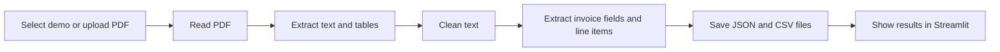

# Invoice Data Parsing Pipeline

A simple Streamlit application that reads an invoice PDF, extracts structured
data, and saves the result as JSON and CSV files.

## How it works



In simple terms:

1. The user selects the sample invoice or uploads a PDF.
2. The PDF is loaded as bytes in memory.
3. PyMuPDF extracts page text and PDF metadata.
4. pdfplumber extracts meaningful tables.
5. The extracted text is cleaned.
6. Invoice fields and line items are converted into structured data.
7. The result is saved inside the `output` folder.
8. Streamlit displays the invoice, text, tables, metadata, and JSON.

## Project structure

```text
data-parsing/
|-- app.py                  # Streamlit user interface
|-- sample_invoice.pdf      # Five-page sample invoice
|-- requirements.txt        # Required Python packages
|-- .env                    # Local configuration and secrets
|-- .env.example            # Safe environment template
|-- output/                 # Generated JSON and CSV results
`-- invoice_pipeline/
    |-- config.py           # Loads and validates .env settings
    |-- sources.py          # Reads local, uploaded, or SharePoint PDFs
    |-- storage.py          # Handles memory, local, or S3 storage
    |-- parsing.py          # Extracts PDF text, tables, and metadata
    |-- cleaning.py         # Removes unnecessary whitespace
    |-- extraction.py       # Extracts invoice fields and line items
    |-- output.py           # Saves structured results
    |-- models.py           # Simple shared type names
    `-- pipeline.py         # Runs all processing steps in order
```

## Run the application

Create and activate a virtual environment:

```powershell
python -m venv env
.\env\Scripts\Activate.ps1
```

Install dependencies:

```powershell
pip install -r requirements.txt
```

Start Streamlit:

```powershell
streamlit run app.py
```

## Available document sources

The current Streamlit UI supports:

- `Demo invoice` — reads `sample_invoice.pdf` from the project.
- `Upload PDF` — processes an uploaded PDF in memory.

The uploaded raw PDF is not saved to disk. Only its extracted result is saved.

SharePoint and S3 code is also available in the backend, but it is not currently
connected to a Streamlit option.

## Extracted data

The pipeline extracts:

- Invoice number and date
- Vendor and customer name
- Total amount and currency
- Product or service line items
- SKU, quantity, UOM, rate, discount, tax, and line total
- Page-wise PDF text
- Meaningful tables
- PDF and source metadata

## Saved output

Every successful run creates a separate timestamped folder:

```text
output/
`-- INV-2026-1048_YYYYMMDD_HHMMSS_microseconds/
    |-- structured_data.json
    |-- tables.json
    `-- tables/
        |-- table_01_page_1.csv
        |-- table_02_page_1.csv
        `-- ...
```

- `structured_data.json` contains the complete parsed result.
- `tables.json` contains all detected tables together.
- The `tables` directory contains one CSV file per meaningful table.

The `output` directory is excluded from Git because it can contain generated or
customer-specific data.

## Local configuration

For demo and upload processing, `.env` only needs:

```dotenv
DEMO_MODE=true
SAMPLE_PDF=sample_invoice.pdf
```

Keep real credentials inside `.env`. The file is excluded from Git. Use
`.env.example` only as a safe configuration template.

## Current limitations

- Scanned image-only PDFs require OCR, which is not implemented yet.
- Header fields are extracted using regular expressions.
- Line-item tables must contain recognizable column names such as
  `Description`, `Qty`, `Rate`, and `Line total`.
- The Streamlit UI currently processes only the demo invoice or uploaded PDFs.
