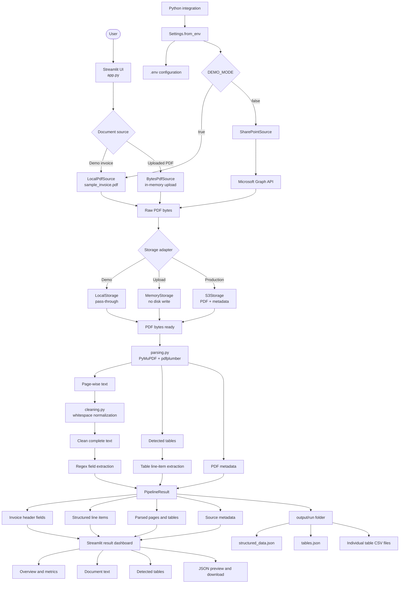
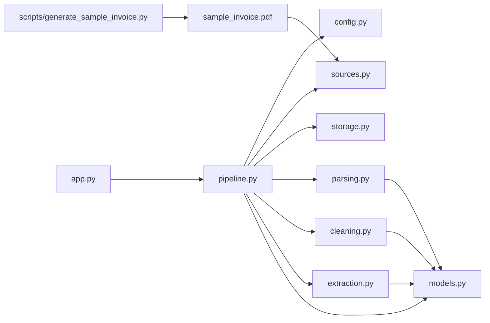
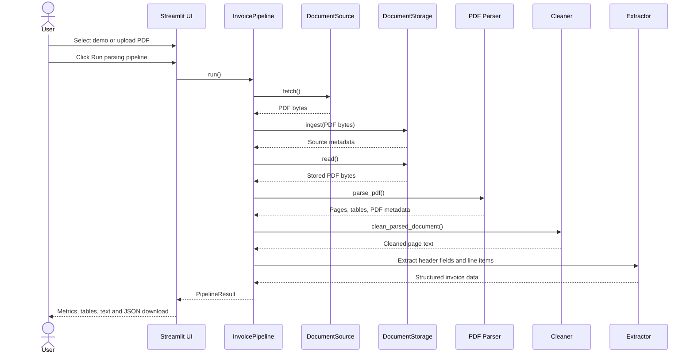

# Invoice Data Parsing Pipeline

A modular, classroom-ready pipeline for:

**Document Source -> Fetching -> Optional Ingestion -> PDF Parsing -> Cleaning -> Structured Extraction -> Streamlit Review**

## Complete project flow



## Architecture by module



## Processing sequence



## Project structure

```text
data-parsing/
|-- app.py                              # Streamlit interface
|-- sample_invoice.pdf                  # five-page synthetic invoice
|-- requirements.txt                    # Python dependencies
|-- output/                             # generated JSON and table CSV files
|-- .env                                # local configuration and secrets
|-- .env.example                        # safe configuration template
|-- invoice_pipeline/
|   |-- __init__.py                     # public package exports
|   |-- config.py                       # environment settings and validation
|   |-- sources.py                      # local, upload and SharePoint sources
|   |-- storage.py                      # memory, local and S3 storage
|   |-- parsing.py                      # PDF text, table and metadata parsing
|   |-- cleaning.py                     # text preprocessing
|   |-- extraction.py                   # invoice fields and line items
|   |-- models.py                       # shared typed data contracts
|   `-- pipeline.py                     # end-to-end orchestration
`-- scripts/
    `-- generate_sample_invoice.py      # reproducible sample generator
```

Each stage has one responsibility. Source and storage protocols make it possible
to replace infrastructure without modifying parsing, cleaning, or extraction.

## Quick start

```powershell
python -m venv .venv
.\.venv\Scripts\Activate.ps1
pip install -r requirements.txt
streamlit run app.py
```

The Streamlit UI supports:

- The bundled five-page demo invoice
- PDF upload processed entirely in memory
- Invoice overview and key metrics
- Structured line-item table
- Extracted page text and detected tables
- Metadata inspection and JSON download
- Automatic structured JSON and table CSV persistence

## Saved output

Every successful pipeline run creates a timestamped folder:

```text
output/
`-- INV-2026-1048_YYYYMMDD_HHMMSS_microseconds/
    |-- structured_data.json
    |-- tables.json
    `-- tables/
        |-- table_01_page_1.csv
        |-- table_02_page_1.csv
        `-- ...
```

`structured_data.json` contains metadata, invoice fields, line items, parsed
page text, detected tables, and saved-file paths. `tables.json` contains all
tables together, while the `tables` directory contains one CSV per table.

## Configuration

Local UI usage works with:

```dotenv
DEMO_MODE=true
SAMPLE_PDF=sample_invoice.pdf
```

For SharePoint and S3 processing, populate the Microsoft Entra ID, SharePoint,
AWS, and S3 values in `.env`, set `DEMO_MODE=false`, and initialize
`InvoicePipeline` from a Python integration.

Secrets stay in `.env`, which is excluded through `.gitignore`. Only
`.env.example` should be committed.

## Sample document coverage

The bundled invoice contains five pages of synthetic enterprise data:

- Supplier and customer identity, addresses, GSTIN and PAN
- Purchase order, contract, challan and e-invoice references
- Ten products and services with SKU, quantity, UOM, rate and discount
- HSN/SAC-wise CGST and SGST reconciliation
- Shipping, GRN, delivery and installation events
- Payment milestones and masked remittance information
- Commercial terms, approvals, compliance controls and audit metadata

Regenerate it when needed:

```powershell
python scripts/generate_sample_invoice.py
```

## Teaching scope

The project intentionally stops at structured extracted data. Chunking,
embeddings, vector search and downstream LLM processing are not implemented.
